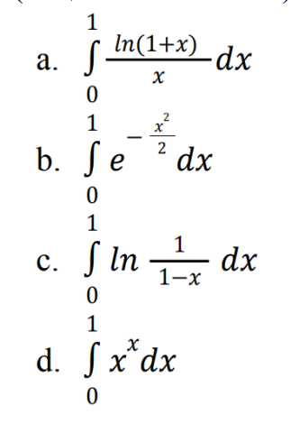

# Лабораторная работа №1.6

# Задание
Вычислить значения интегралов используя метод трапеций с точностью ε, где ε
(вещественное число) подаётся программе в виде аргумента командной строки:



# Запуск

```
make
./main.out epsilon
```

## Тест 1. Проверка нет точности
```
./main.out
```

## Тест 2. Проверка невалидные данные

```
./main.out 0
```

```
./main.out -1.00
```


```
./main.out .011
```

```
./main.out 0.111.
```

## Тест 3. Проверка на валидные данные, с разной точностью

```
./main.out 0.01
```


```
./main.out 0.000001
```
